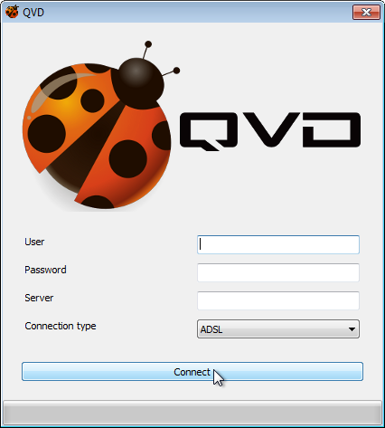
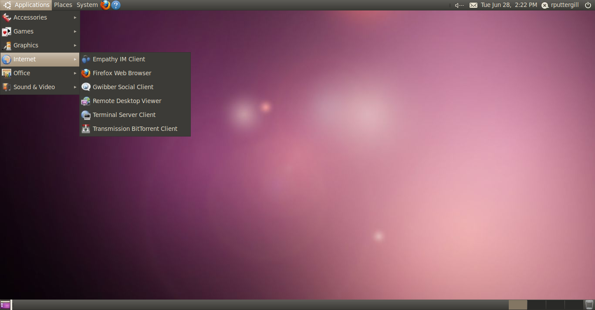
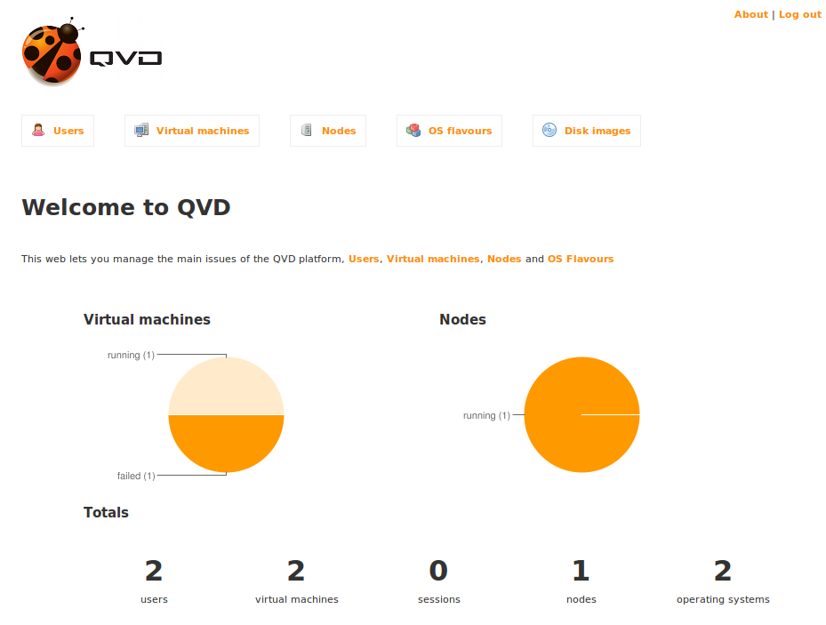
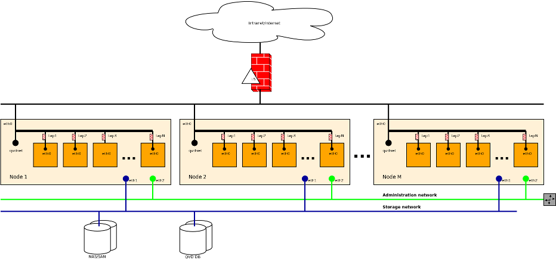
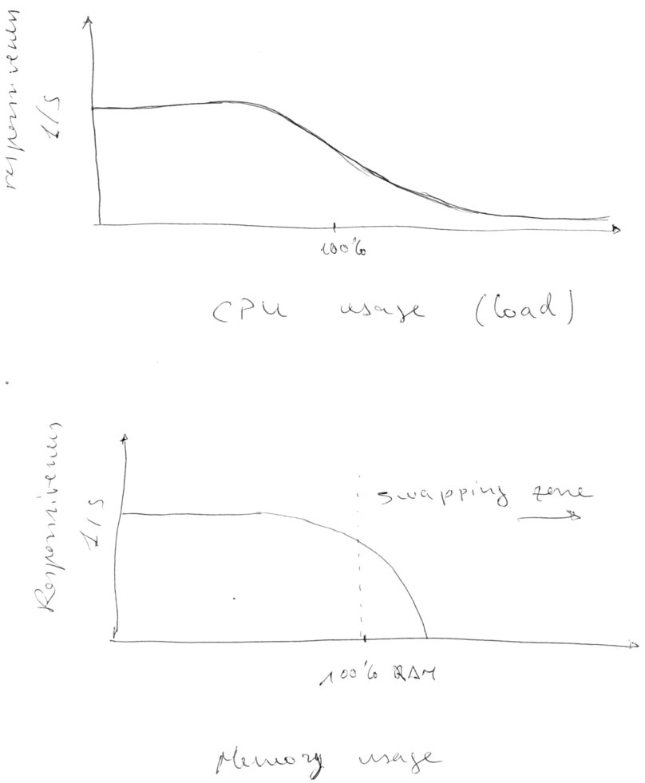

# QVD

Salvador Fandiño (salvador@qindel.es)

QindelGroup

---

## Web de QVD:

http://theqvd.com

## Esta presentación:

http://github.com/salva/s-qvd-gul-uc3m

---

# QVD

- Producto de "Virtual Desktop Infrastructure" (VDI)

- 100% Open Source

- 100% Linux

---

# Cliente

- Linux
- Windows
- OS X
- Android
- iOS (en desarrollo)
- Plugin Firefox/Chrome (en desarrollo)

---

---

# Escritorio virtual

- Linux
    + Gnome
    + KDE
    + **LXDE**
    + **XFCE**
    + IceWM
    + Otros

---

---

# Servidor/Granja

- Linux
    + Ubuntu
    + SuSE
    + RedHat

---

# Administración

- Herramienta Web

- Herramienta de linea de comandos

---

---

# Algunas caracteristicas destacadas

- Eficiencia de la solución (CPU, RAM, I/O y ancho de banda)
- Escalabilidad (10.000 usuarios por granja, 400 VMs por nodo)
- Gestión de imagenes de disco inspirado en los sistemas de control de versiones
- Integrable y adaptable (Open Source, arquitectura)
- Tambien funciona como servidor de aplicaciones
- No soportamos imagenes de Windows

---

# Arquitectura

---

# Por dentro

- Linux
- Virtualizadores KVM y LXC
- HTTP/SSL para la comunicacion cliente-servidor
- NX para compression del protocolo X11
- iptables y ebtables para confinamiento de las VMs
- PostgreSQL
- Desarrollado en Perl, C, Javascript

---

# ¿Preguntas?

---

---

# Exprimiendo Linux

---

# Cuellos de botella

- **RAM**
- **I/O**
- CPU
- Red
- Kernel

---

---

# Interdependientes

- Si aumenta el uso de memoria por los procesos &rarr; menos memoria para buffer de disco &rarr; aumenta el I/O
- Si aumenta el acceso al disco por los procesos &rarr; aumenta el uso de memoria como buffers &rarr; aumenta el uso de RAM
- Si aumenta el uso de swap &rarr; aumenta la carga de I/O

---

# Maquinas virtuales

- KVM, Xen, VMWare, etc.
- Cada maquina virtual tiene su propio kernel.
- Las VMs no colaboran sino que compiten por los recursos.
- Cada VM tiene sus buffers de I/O
- Las VMs usan el 100% de la memoria asignada.

---

# Parches...

- KSM - busca y reduce paginas de memoria duplicadas
  + el consumo de CPU no es despreciable, tiene mal escalado O(N).
  + no detecta paginas que no estan siendo utilizadas
  + muy efectivo con los buffers de I/O
  + poco efectivo con la memoria de procesos que usan JITs o muchas
  estructuras dinamicas (por ejemplo, GTK+)

---

# Parches...

- Balloon driver - pincha un agujero en la RAM de la maquina virtual y
  se la devuelve al sistema anfitrion.
     + limitado a unos pocos MBs por VM.
     + proceso manual
